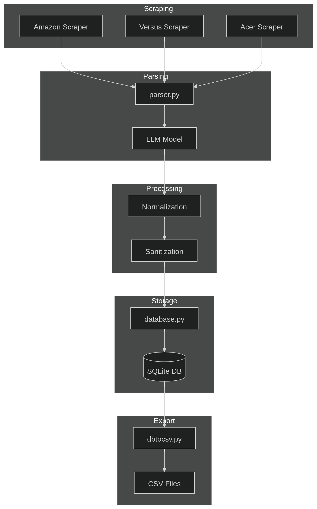
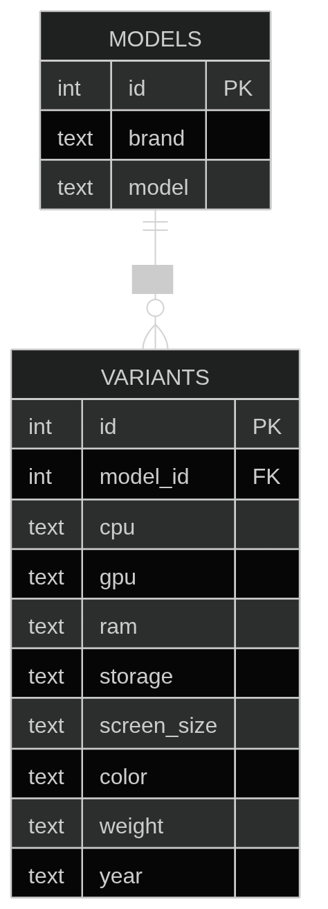

# Retello Data Scraper

A Python-based web scraper that collects laptop product data from various e-commerce and comparison websites, parses product titles using a local LLM, and stores structured data in an SQLite database.

## Features

- **Web Scraping**: Scrapes product data from:
  - Versus.com (comparison site)
  - Amazon.in
  - Croma.com
  - Flipkart.com
- **Data Parsing**: Uses Ollama with Qwen2.5 3B model to extract structured specifications from product titles
- **Data Cleaning**: Sanitizes and standardizes product data (GPU, RAM, Storage, etc.)
- **Database Storage**: Stores parsed data in SQLite database with normalized schema
- **Data Export**: Exports database contents to a JSON file (`products.json`)

## Project Structure

```
retello/
├── main.py              # Main script for scraping and processing data
├── scrapper.py          # Web scraping functions using Selenium and Playwright
├── parser.py            # LLM-based title parsing using Ollama
├── acer.py              # Additional scraper (currently commented out)
├── products.json        # Exported product data in JSON format
├── requirements.txt     # Python dependencies
├── Database/
│   ├── database.py      # Database operations and schema
│   └── updates.py       # Database update utilities
├── images/              # Project images (e.g., architecture diagrams)
├── __pycache__/         # Python cache files
└── README.md            # This file
```

<!--  -->

## Installation

1. **Clone the repository**:
   ```bash
   git clone https://github.com/resumetozero/retello_data.git
   cd retello_data
   ```

2. **Create a virtual environment**:
   ```bash
   python -m venv venv
   source venv/bin/activate  # On Windows: venv\Scripts\activate
   ```

3. **Install dependencies**:
   ```bash
   pip install -r requirements.txt
   ```

4. **Install Ollama** (for LLM parsing):
   - Download and install Ollama from [ollama.ai](https://ollama.ai)
   - Pull the Qwen2.5 3B model:
     ```bash
     ollama pull qwen2.5:3b
     ```

5. **Install Chrome/Chromium** (required for Selenium):
   ```bash
   # On Ubuntu/Debian:
   sudo apt-get install chromium-browser
   
   # On other systems, install Chrome or Chromium accordingly
   ```

## Usage

1. **Run the scraper**:
   ```bash
   python main.py
   ```
   Enter your search query when prompted (e.g., "laptop"). The script will scrape data from the websites, parse titles using the LLM, clean the data, store it in the database, and export to `products.json`.

## Database Schema

The SQLite database (`Database/new_all_products.db`) contains two main tables:

- **models**: Stores unique brand and model combinations
- **variants**: Stores specific product variants with specifications

<!--  -->


### Models Table
- `id`: Primary key
- `brand`: Product brand (e.g., "Acer")
- `model`: Model name (e.g., "Aspire Lite AL15-53")

### Variants Table
- `id`: Primary key
- `model_id`: Foreign key to models table
- `cpu`: Processor model
- `gpu`: Graphics card model
- `ram`: RAM capacity (e.g., "16GB")
- `storage`: Storage capacity and type (e.g., "512GB SSD")
- `screen_size`: Display size (e.g., "15.6 inch")
- `color`: Product color
- `weight`: Product weight
- `year`: Release year

## Dependencies

- **beautifulsoup4**: HTML parsing
- **selenium**: Web browser automation for Versus.com
- **requests**: HTTP requests
- **pandas**: Data manipulation
- **playwright**: Web automation for Amazon.in and Flipkart.com
- **lxml**: XML/HTML parser
- **Ollama**: Local LLM for title parsing

## Configuration

- **Ollama URL**: Default is `http://localhost:11434/api/generate`
- **Model**: Currently using `qwen2.5:3b`
- **Database Path**: `Database/new_all_products.db`

## Notes

- The scraper uses headless Chrome for web scraping (Selenium for Versus, Playwright for others)
- LLM parsing requires Ollama to be running locally
- Some scrapers (HP, Dell, Acer) are commented out in the main script
- The project focuses on laptop specifications extraction
- Data is exported to `products.json` after processing